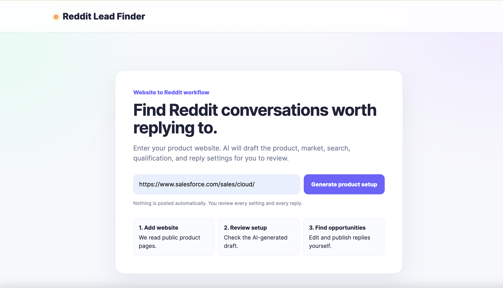
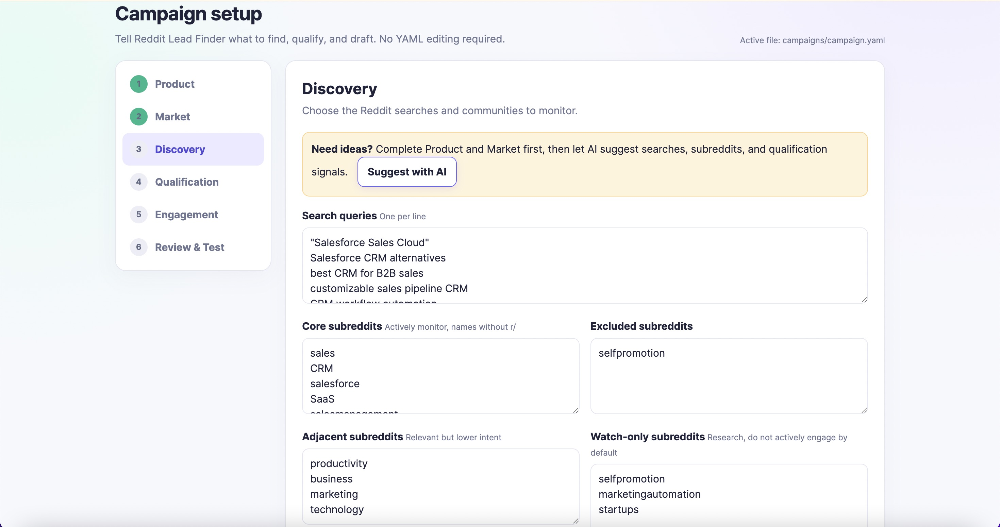
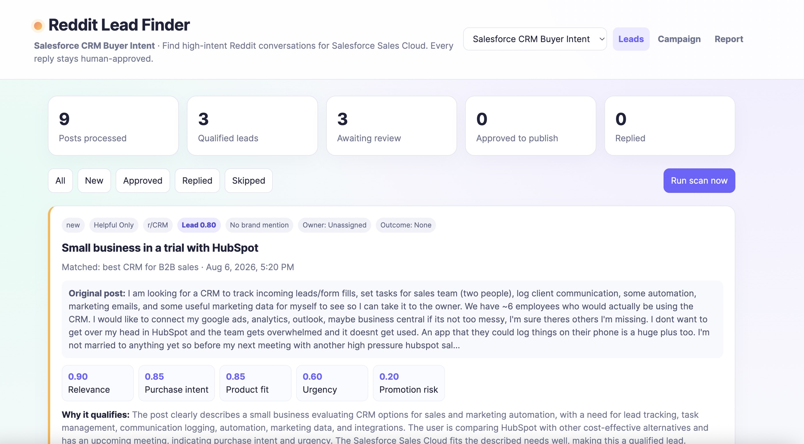

# Reddit Lead Finder

**Turn one product URL into a complete Reddit marketing workflow.**

Paste a public product website. Reddit Lead Finder researches the product, builds a
campaign, finds relevant Reddit conversations, scores purchase intent, and generates
personalized reply drafts for human review.

It is an open-source, self-hosted, human-in-the-loop Reddit marketing and lead
discovery tool. It never posts comments, sends DMs, or votes automatically.

## Product walkthrough

### 1. From product URL to AI-powered Reddit workflow

<p align="center">
  
</p>

Paste in a product website, then turn it into a complete Reddit marketing workflow: campaign setup, discovery, AI scoring, reply drafting, notifications, and human review.

### 2. AI-generated campaign setup

<p align="center">
  
</p>

AI creates an editable campaign with target customers, value propositions, competitors, buyer signals, search queries, and relevant subreddits.

### 3. Review high-intent opportunities and reply drafts

<p align="center">
  
</p>

Review qualified conversations, understand the AI scoring, edit personalized reply drafts, and publish manually when appropriate.

## From product URL to reply draft

1. **Add a product URL**

   Enter a public website. The app reads a limited set of public product pages.

2. **Build the campaign with AI**

   AI drafts the product description, value propositions, target customers,
   competitors, markets, buyer signals, search queries, and relevant subreddits.

3. **Find relevant Reddit posts**

   Perplexity Search API searches public `reddit.com` pages using broad buyer-language
   queries. Exact product-name matches are not required. Apify can optionally supplement
   the results when the primary search is insufficient.

4. **Analyze intent and product fit**

   OpenAI evaluates relevance, purchase intent, product fit, urgency, reachability,
   market fit, and promotion risk.

5. **Generate a reply draft**

   Qualified opportunities receive a strategy and a concise, campaign-specific reply
   draft. Lower-scoring candidates remain visible under **Skipped** with the AI reason.

6. **Review and publish manually**

   A human reads the original thread, checks subreddit rules, edits the draft, and
   decides whether to publish.

```text
Product URL
    -> AI Product Campaign
    -> Relevant Reddit Posts
    -> Intent & Fit Scoring
    -> Personalized Reply Drafts
    -> Human Review & Publishing
```

## What the AI-generated campaign contains

The browser-based Product Setup creates six editable sections:

1. **Product**: description, value propositions, target customers, competitors, and limitations
2. **Market**: countries, languages, customer signals, and exclusions
3. **Discovery**: buyer-language queries, core subreddits, adjacent communities, and lookback window
4. **Qualification**: buying signals, noise signals, score threshold, and maximum post age
5. **Engagement**: reply tone, brand mentions, links, disclosure, and length guardrails
6. **Review & Test**: test the campaign against a sample Reddit post before a real scan

Every field can be reviewed and edited before the campaign is saved.

## Who it is for

- Growth and product marketing teams
- Founders and early-stage startups
- Agencies managing multiple products or clients
- Sales and community teams researching active buyer conversations
- Operators who want AI assistance without automated posting

## Core features

- Website-to-campaign AI generation
- Semantic and keyword-based Reddit discovery
- Product, competitor, problem, recommendation, pricing, migration, and comparison queries
- Perplexity Search API as the primary discovery provider
- Optional Apify fallback
- OpenAI intent and product-fit analysis
- Explainable multi-dimensional scoring
- Reply strategy selection before drafting
- Personalized, editable reply drafts
- Human approval before every reply
- Independent multi-product campaign workspaces
- `Needs review`, `Ready to reply`, `Published`, and `Skipped` workflow
- Slack and email notifications
- SQLite, CSV, Markdown, and client-ready performance reports
- Cross-post deduplication
- Optional dashboard password protection
- Docker and local Python setup

## How discovery works in V0.7.5

Perplexity is the primary search provider. Each campaign query is sent as an individual
Search API request with `reddit.com` as the domain filter and the campaign's selected
lookback window. Returned pages are normalized, deduplicated, and validated as Reddit
posts before OpenAI analysis.

Discovery is designed for semantic recall. A post can qualify when it describes the
same problem, buying situation, competitor pain, implementation question, or desired
outcome even when it never mentions the campaign product by name.

Apify is optional. It runs only when enabled and Perplexity fails or returns fewer than
the configured minimum number of usable posts. Apify comment crawling and Actor-side AI
analysis are disabled.

By default, automatic scans run every hour and up to 150 new posts can be sent to
OpenAI analysis per scan. Manual scans are also available.

## Quick start with Docker

```bash
git clone https://github.com/rui-ning-716/ai-powered-reddit-lead-finder.git
cd ai-powered-reddit-lead-finder
cp .env.example .env
```

Add your keys to `.env`:

```text
OPENAI_API_KEY=your_openai_key
PERPLEXITY_API_KEY=your_perplexity_key

# Optional fallback
APIFY_API_TOKEN=
```

Start the application:

```bash
docker compose up --build
```

Open [http://localhost:8000](http://localhost:8000).

## Run locally without Docker

```bash
git clone https://github.com/rui-ning-716/ai-powered-reddit-lead-finder.git
cd ai-powered-reddit-lead-finder
python3 -m venv .venv
source .venv/bin/activate
pip install -r requirements.txt
cp .env.example .env
```

Add the OpenAI and Perplexity keys to `.env`, then run:

```bash
python -m uvicorn app.main:app --host 127.0.0.1 --port 8000
```

Open [http://127.0.0.1:8000](http://127.0.0.1:8000).

## First campaign

1. Enter a public product website on the first screen.
2. Select **Generate product setup**.
3. Review all six campaign sections.
4. In Discovery, confirm the search queries, subreddits, lookback window, and results per query.
5. In Qualification, confirm the score threshold and maximum post age.
6. Test the campaign with a sample Reddit post.
7. Select **Save and find opportunities**.
8. Review qualified drafts under **Reply Opportunities**.

Use **+ Add product** to create another isolated product or client workspace.

## Opportunity scoring

The AI returns separate component scores. The final priority is recalculated in code
using campaign-controlled weights and penalties.

| Dimension | Question |
| --- | --- |
| Relevance | Does the post match the problem or use case? |
| Purchase intent | Is the author seeking, comparing, replacing, or paying for a solution? |
| Product fit | Can the product genuinely solve the need? |
| Urgency | Does the author need a solution soon? |
| Reachability | Can a useful public reply help? |
| Market fit | Is there explicit evidence of a match or mismatch? |
| Promotion risk | Would a brand response feel intrusive? |

Missing budget, geography, company size, or timeline is treated as unknown evidence,
not an automatic rejection. An explicit mismatch can reduce priority.

## Reply strategies

- `helpful_only`: help without mentioning the product
- `expert_answer`: provide domain guidance without mentioning the product
- `soft_mention`: help first, then disclose affiliation and mention the product briefly
- `direct_recommendation`: use only for explicit requests with strong product fit
- `skip`: do not engage

Brand mentions and direct links follow campaign guardrails. A draft is never published
automatically.

## Multiple products and reporting

Each product workspace keeps separate campaign settings, opportunities, reply drafts,
statuses, notifications, assignments, outcomes, and conversion values. The same Reddit
post can be evaluated independently for different products.

Open `/report` for performance metrics or `/report.csv` for a live export. See
[`docs/MANAGED_SERVICE.md`](docs/MANAGED_SERVICE.md) for an operator-run pilot workflow.

## Optional notifications

Slack:

```text
SLACK_NOTIFICATIONS_ENABLED=true
SLACK_WEBHOOK_URL=https://hooks.slack.com/services/...
SLACK_MIN_INTENT_SCORE=0.72
```

Email:

```text
EMAIL_NOTIFICATIONS_ENABLED=true
SMTP_HOST=smtp.gmail.com
SMTP_PORT=587
SMTP_USERNAME=you@example.com
SMTP_PASSWORD=app-password
EMAIL_FROM=you@example.com
EMAIL_TO=owner@example.com
```

Notification failures do not stop scanning.

## Dashboard protection

For a dashboard reachable outside your computer, configure both values and use HTTPS:

```text
DASHBOARD_USERNAME=operator
DASHBOARD_PASSWORD=use-a-long-unique-password
```

This is suitable for an operator-run pilot, not a public multi-tenant SaaS authentication system.

## Safety and community respect

Reddit Lead Finder does not automatically post, send DMs, vote, create accounts, or
hide affiliation. Before replying:

1. Read the full thread.
2. Check current subreddit rules.
3. Edit the draft for accuracy and context.
4. Disclose affiliation when mentioning your product.
5. Skip conversations where brand participation would feel intrusive.

Review Reddit's [Spam policy](https://support.reddithelp.com/hc/en-us/articles/360043504051-Spam)
and [Responsible Builder Policy](https://support.reddithelp.com/hc/en-us/articles/42728983564564-Responsible-Builder-Policy).

## Development

```bash
make install
make test
make check
```

Never commit `.env`, `data/`, exports, or SQLite files. See [`SECURITY.md`](SECURITY.md).

## License

MIT

